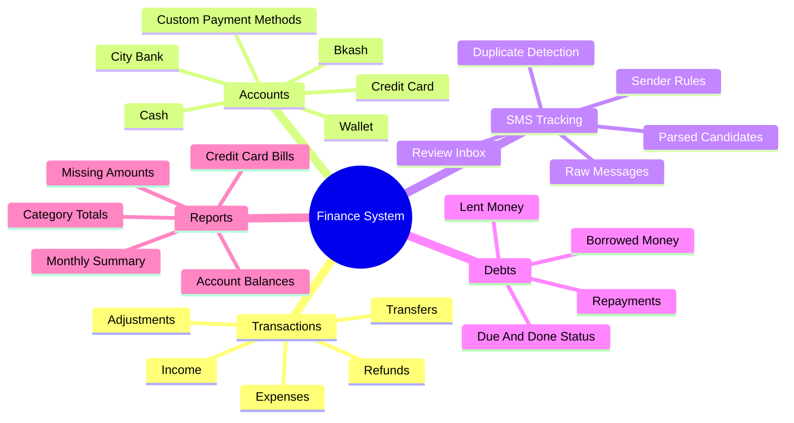

# Personal Finance System Plan

This folder contains the product and engineering plan for a personal finance
system built around:

- Next.js web app
- Django REST backend
- PostgreSQL database
- React Native Android mobile app
- SMS-based transaction capture

The first phase is for personal use, but the design keeps a path open for a
future product.

## Recommended Repository Strategy

Start as a structured monorepo-style workspace with separate projects:

```txt
finance-system/
  finance-api/
  finance-web/
  finance-mobile/
  finance-infra/
  finance-contracts/
```

Each project should have its own dependencies, README, environment files, test
commands, and deployment boundary. This gives the speed of one workspace while
preserving clean separation.

Move to separate repositories later if the project becomes a product, gains
multiple contributors, needs independent deployment pipelines, or needs stricter
access control between backend, mobile, and web teams.

## Contents

- [Architecture](docs/architecture.md)
- [Domain Model](docs/domain-model.md)
- [Technical Spec](docs/technical-spec.md)
- [Roadmap](docs/roadmap.md)
- [First Sprint Plan](docs/first-sprint.md)
- [Next Steps Checklist](docs/next-steps-checklist.md)
- [Phase 3 SMS Parser Plan](docs/phase-3-sms-parser-plan.md)
- [Auth Token Storage Plan](docs/auth-token-storage-plan.md)
- [Mobile SMS Permission Decision](docs/mobile-sms-permission-decision.md)
- [Decisions And Questions](docs/decisions-and-questions.md)
- [Local Setup](docs/local-setup.md)
- [Git Workflow](docs/git-workflow.md)
- [Privacy And Security](docs/privacy-and-security.md)
- [Project Q&A](qa/README.md)
- [Agent Instructions](AGENTS.md)
- [Backend Project](projects/finance-api/README.md)
- [Web Project](projects/finance-web/README.md)
- [Mobile Project](projects/finance-mobile/README.md)
- [Infrastructure Project](projects/finance-infra/README.md)
- [API Contracts Project](projects/finance-contracts/README.md)

## Product Goals

The system should replace and improve the existing spreadsheet workflow:

- Track daily costs, income, balances, debts, credit card activity, and cashflow.
- Support manual entry from both web and mobile.
- Automatically capture and parse transaction SMS messages on Android.
- Let the user manage payment methods and message sender rules.
- Show missing/unreconciled amounts when real-life balances differ from expected
  balances.
- Keep BDT as the only currency for the first version.
- Start locally, then prepare for online deployment later.
- Use deterministic rules first; add AI categorization later.

## Key Product Areas



## Initial Assumptions

- The first real user is one person.
- Android is the first and only mobile platform.
- BDT is the only currency in phase 1.
- The backend is the source of truth.
- SMS parsing starts with provider-specific rules, not AI.
- Manual balance reconciliation is allowed.
- Lent money and debt affect account balances only when money actually moves.

## Current Implementation Status

- Planning documentation is complete for the first architecture pass.
- Local Docker infrastructure is defined in `projects/finance-infra` for
  PostgreSQL, API, web, and optional mobile runtime.
- Django API is implemented in `projects/finance-api` with health, auth,
  accounts, categories, payment methods, messages, transactions, reports,
  debts, and reconciliation modules.
- The manual finance API loop covers accounts, categories, transactions,
  monthly reports, debts, repayments, and balance snapshots.
- Phase 2 kickoff is complete across API, contracts, web, and mobile scaffolds:
  payment methods, sender rules, raw SMS import, duplicate detection, parsed
  review candidates, and local mobile raw-message queue.
- Phase 3 backend foundations are in place for starter provider parsers,
  internal-transfer hints, debt/repayment workflows, reconciliation snapshots,
  and production auth/token planning.
- JWT authentication is available for web and mobile clients.
- The Next.js web app can display backend health.
- The web app has a local-development login flow for JWT auth.
- The web app has a first manual transaction page connected to the backend API.
- The web app can create and list accounts and categories.
- The web app can manage payment methods and SMS sender rules.
- The web app can review parsed SMS candidates and confirm or ignore them.
- The web app has a first monthly reports page.
- The web transaction list supports month, type, account, and category filters.
- The mobile app has an SMS tracking settings scaffold for permission gating
  and sender rule selection.
- The mobile app can queue raw SMS messages locally and sync them to the backend
  import endpoint.
- The mobile app can review parsed SMS candidates and confirm or ignore them.
- Confirmed transactions now keep stricter ledger evidence fields including
  debit/credit direction, provider reference, balance after, counterparty text,
  payment method, raw SMS link, and duplicate-detection key.

## Next Milestone

Phase 3 should now focus on validating the workflow with real anonymized SMS
fixtures, deepening bKash/EBL/City Bank/Pathao Pay parser coverage, polishing
debt and reconciliation UI, hardening mobile sync, and preparing production
deployment. The next SMS parser pass should fill the richer final transaction
fields rather than leaving important finance evidence only in raw SMS text.
