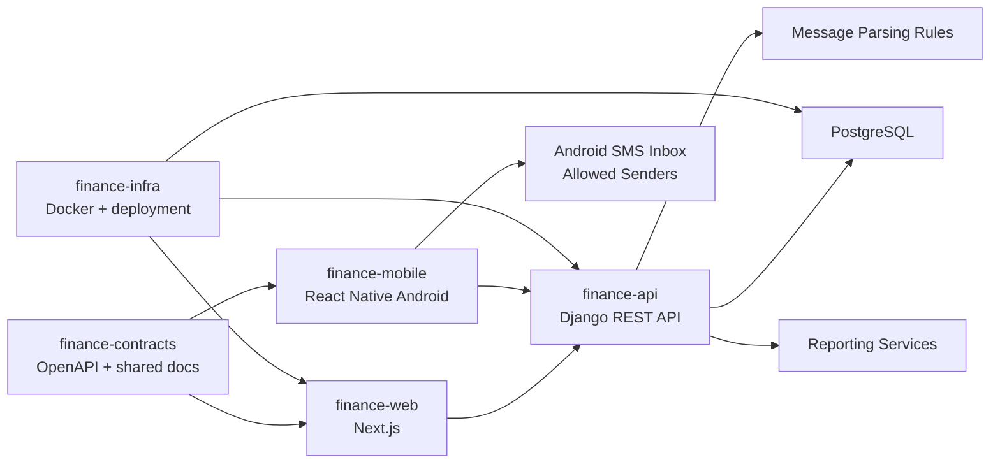
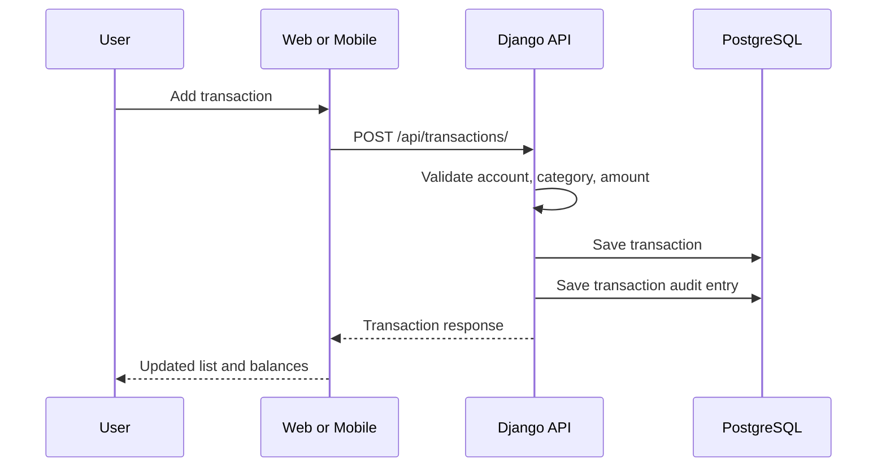
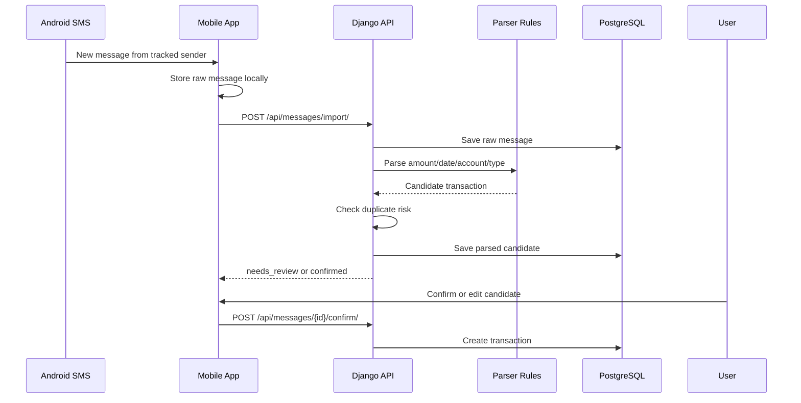

# Architecture

## System Overview



## Project Boundaries

### finance-api

The backend owns:

- Authentication and authorization
- Transaction ledger
- Account and payment method management
- Category management
- SMS message ingestion and parsing
- Duplicate detection
- Reports and summaries
- Debt and repayment tracking
- Credit card bill tracking
- Recurring bill tracking
- Balance reconciliation

### finance-web

The web app owns:

- Dashboard and reporting UI
- Spreadsheet-like transaction management
- Account and payment method management
- SMS review inbox
- Debt and credit card management
- Reconciliation workflows

### finance-mobile

The Android app owns:

- Quick transaction entry
- SMS sender rule setup
- Local SMS collection
- Raw message sync to backend
- Review and confirm parsed transactions
- Offline queue for manual entries

### finance-infra

The infrastructure project owns:

- Local Docker Compose
- PostgreSQL setup
- Environment templates
- Deployment notes
- Backup and restore scripts later

### finance-contracts

The contracts project owns:

- OpenAPI schema
- API examples
- Shared event/data shape documentation
- Generated TypeScript client later

## Data Flow: Manual Transaction



## Data Flow: SMS Transaction



## Balance Philosophy

Expected account balances are calculated from confirmed money movement:

- Expenses reduce an account.
- Income increases an account.
- Transfers reduce one account and increase another.
- Lending money reduces the source account and creates a receivable debt record.
- Getting repaid increases the receiving account and reduces the receivable debt.
- Borrowing money increases the receiving account and creates a payable debt.
- Paying debt reduces the source account and reduces the payable debt.

Manual real-life balance snapshots are stored separately. When a snapshot does
not match the calculated balance, the system shows the missing amount and allows
the user to create an adjustment transaction if needed.

## Local Development Shape

```txt
finance-system/
  finance-api/       # Django, DRF, pytest
  finance-web/       # Next.js, TypeScript
  finance-mobile/    # React Native Android
  finance-infra/     # docker-compose.yml
  finance-contracts/ # openapi.yaml
```

Run locally with Docker for PostgreSQL and native dev servers for backend, web,
and mobile.
