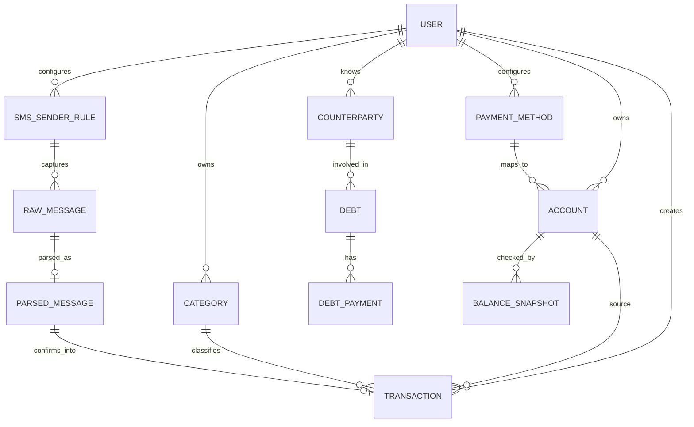

# Domain Model

## Core Entities

## User

Phase 1 has one main user, but the model should still include a user boundary so
future productization is possible.

Important fields:

- email
- password hash or OAuth identity
- default currency: BDT
- timezone
- preferences

## Account

Represents where money can move from or to.

Examples:

- Cash
- Home cash
- Wallet
- Bkash
- City Bank
- Credit card
- Custom payment method

Important fields:

- name
- type: cash, mobile_wallet, bank, credit_card, savings, other
- currency: BDT
- starting_balance
- is_active
- display_order

## Payment Method

Payment methods are user-managed labels and rules that help connect SMS senders,
accounts, and transaction types.

Examples:

- Bkash personal
- City Bank debit card
- City Bank credit card
- Cash
- Wallet

Important fields:

- name
- provider
- linked_account
- last_digits or identifier, optional
- message_sender_patterns
- active status

## SMS Sender Rule

Allows the user to say: "track transaction reports from this number."

Important fields:

- sender_name_or_number
- provider: bkash, bank, card, nagad, rocket, custom
- linked_payment_method
- enabled
- parse_mode: provider_template, regex_rule, manual_review
- notes

## Raw Message

Stores the original SMS payload for audit and parser improvement.

Important fields:

- sender
- body
- received_at
- device_message_id
- hash
- imported_at
- source_device
- status: new, parsed, ignored, duplicate, error

## Parsed Message

Stores what the system thinks the SMS means.

Important fields:

- raw_message
- provider
- message_kind: purchase, cash_in, cash_out, transfer, fee, refund, reversal,
  balance_notice, unknown
- detected_amount
- detected_date
- detected_account
- detected_destination_account, optional
- detected_type
- detected_counterparty
- detected_reference
- detected_balance
- detected_fee
- possible_internal_transfer
- confidence_score
- needs_review
- parser_version
- error_reason

Internal transfers are important enough to model explicitly. A bank-to-bKash
top-up, wallet cash-in, card bill payment, or transfer between the user's own
accounts should not become a fake expense or fake income. The parsed candidate
should preserve source and destination hints so the review flow can confirm a
transfer when both sides are known.

## Transaction

Stores confirmed financial activity.

Important fields:

- date
- type: expense, income, transfer, adjustment, fee, refund, lend, borrow,
  repayment_received, repayment_paid
- amount
- account
- transfer_account, optional
- category
- counterparty, optional
- note
- source: web, mobile, sms, import, system
- original_message, optional
- confidence_score, optional
- needs_review

## Category

Examples based on the spreadsheet:

- Food
- Groceries
- Transportation
- Medicine
- Shopping
- Bills
- Home
- Card
- Bkash
- Debt money
- Lend money
- Extra
- No idea

Categories should be editable and support parent categories later.

## Debt

Tracks money owed separately from the normal account ledger, while still
creating money movement transactions when cash actually changes hands.

Important fields:

- direction: lent_by_me, borrowed_by_me
- counterparty
- principal_amount
- current_balance
- opened_at
- due_date, optional
- status: open, partially_paid, paid, written_off
- linked_transaction
- note

## Balance Snapshot

Manual real-life check of an account balance.

Important fields:

- account
- checked_at
- actual_balance
- expected_balance_at_time
- difference
- status: matched, missing_money, extra_money, adjusted
- adjustment_transaction, optional

## Transaction Sign Display

The backend should store transaction type and positive amount values. The web
and mobile apps can provide display options:

- Spreadsheet mode: expenses show negative, income shows positive.
- Ledger mode: amount is positive and type/status shows direction.
- Account mode: show money in and money out columns.
