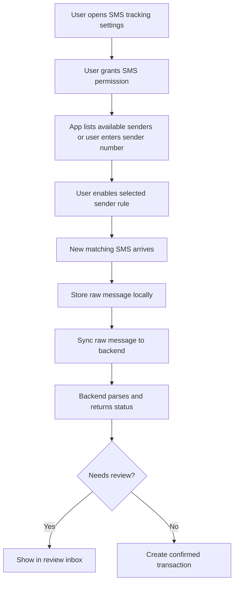

# finance-mobile

React Native Android app for quick capture and SMS-based transaction tracking.

## Responsibilities

- Quick manual transaction entry.
- Account/category sync.
- Android SMS permission flow.
- User-selected tracked SMS sender numbers.
- Local raw message storage.
- Message sync to backend.
- Review parsed transactions.
- Offline queue for manual entries.

## Suggested Stack

- React Native
- TypeScript
- React Navigation
- TanStack Query
- SQLite or MMKV for local queue/cache
- Native Android SMS module when needed

Expo can be used only if the SMS requirements remain compatible. If automatic
SMS reading requires native Android APIs not supported by Expo managed workflow,
use bare React Native.

## Android SMS Tracking Flow



## Mobile Screens

```txt
Home
Quick Add Transaction
Transactions
Accounts
SMS Tracking Settings
SMS Review Inbox
Debts
Settings
```

## Offline Requirements

- Manual transactions can be saved offline.
- Raw SMS messages can be queued offline.
- Sync retries when network is available.
- Conflicts are resolved by backend timestamps and ids.

## Phase 1 Mobile Milestones

1. Android app skeleton.
2. Login.
3. Backend health check.
4. Account/category fetch.
5. Quick add transaction.
6. Transaction list.

## Phase 2 Mobile Milestones

1. SMS permission flow.
2. Sender number management.
3. Local raw message cache.
4. Raw message sync.
5. Review inbox.

