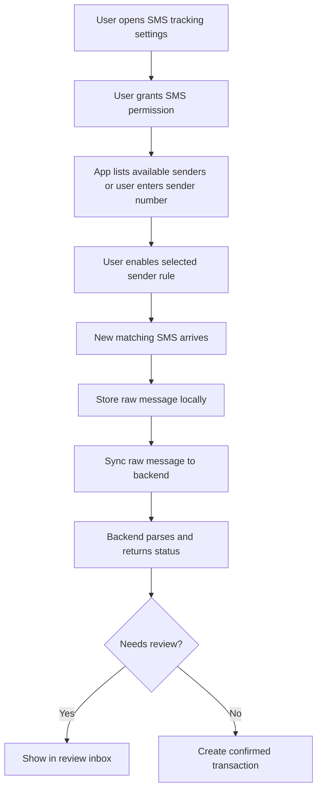

# finance-mobile

React Native Android app for quick capture and SMS-based transaction tracking.

## Current Status

Phase 1 scaffold now includes:

- Expo + React Native TypeScript setup.
- Bundled Material Community icon font preloaded before rendering app screens.
  Standalone builds include the SDK-compatible `expo-file-system` native module
  required by `expo-asset` to copy the font into its local cache. Font loading
  failures show a readable startup error instead of silently blank icons.
  The Android manifest blocks the dependency's external-storage permissions;
  font loading only uses the app's private cache.
- Environment-based API base URL (`EXPO_PUBLIC_API_BASE_URL`).
- Health check screen that calls `GET /api/health/`.
- Login test flow that calls `POST /api/auth/login/`.
- Access-token validation flow that calls `GET /api/auth/me/`.
- Persistent mobile session backed by Expo SecureStore:
  - stores the rotated JWT pair in Android Keystore-backed storage
  - validates the saved access token on launch and refreshes only when needed
  - transparently refreshes and retries authenticated API calls once after a
    mid-session `401`
  - revokes the refresh token and removes the saved session on explicit logout
- Account and category fetch flow for authenticated users:
  - `GET /api/accounts/`
  - `GET /api/categories/`
  - caches the latest account/category lists locally for offline form choices
- Quick add transaction form:
  - `POST /api/transactions/`
- Local manual transaction queue:
  - stores manual transaction drafts with AsyncStorage
  - syncs queued manual transactions to `POST /api/transactions/`
  - uses retry metadata and capped retry backoff for failed syncs
  - blocks obvious duplicate queued transactions
  - lets the user remove invalid queued transactions manually
- Transaction list flow:
  - `GET /api/transactions/`
  - caches the latest loaded transactions locally for offline startup review
- SMS tracking settings scaffold:
  - Android SMS permission gate for custom native builds
  - `GET /api/payment-methods/`
  - `GET /api/messages/sender-rules/`
  - local sender rule enable/disable selection
  - applies exact, contains, and regex rules consistently across React Native,
    native capture, and the backend
  - immediately syncs sender-rule toggle changes into the local native module
  - discovers distinct sender names and message counts from the Android inbox
    without exposing message bodies in the rule picker
  - supports sender search, account mapping, provider selection, backend rule
    creation, local enablement, and immediate native-rule sync
  - loads and updates the server-side capture policy for provider,
    OTP/security, and balance-notice exclusions
  - wraps capture-policy and retention options into visible rows, with 48-point
    minimum tap targets and multi-line labels for larger text sizes
  - cancels a setting selection after touch movement exceeds eight points,
    including a drag that returns to its start; accessibility activation remains
    available without a touch gesture
  - removes excluded providers from native sender capture immediately
  - presents a four-step setup checklist and lets the user choose immediate,
    7-day, 30-day, or manual raw-SMS redaction after confirmation
  - publishes permission, queue, failure, scan, and successful-sync heartbeats
    to `POST /api/messages/device-status/`
- Local raw message queue:
  - stores queued raw messages with Android Keystore-backed encryption in
    native builds or Expo SecureStore as a fallback
  - shows inline loading, success, empty, and error feedback when sender rules
    are refreshed, including the signed-in username for account troubleshooting
- Historical SMS backfill in native Android builds:
  - lets the user scan only new messages or choose a historical date range
  - evaluates only user-enabled sender rules
  - records deterministic message fingerprints so previously scanned messages
    are not imported again
  - can deliberately revisit previous imports and re-run pending review items
    through the latest backend parser without rewriting confirmed transactions
  - queues before uploading so an interrupted sync does not lose a message
  - syncs queued messages to `POST /api/messages/import/`
  - keeps failed sync items queued for retry
  - records attempt count, last attempt time, next retry time, and last error per queued message
  - uses a capped exponential retry delay so failed messages are not retried on every tap
  - blocks obvious local duplicate queue entries before backend sync
  - lets the user remove invalid queued messages manually
  - uploads newly received, trusted SMS messages with WorkManager when a
    network is available, including one JWT refresh attempt
  - keeps API-rejected messages encrypted on the device for explicit retry
  - exposes a two-step, debug-build-only reset that clears local scan memory and
    the signed-in user's backend SMS test data; the backend rejects it when
    `DJANGO_DEBUG=false`
- SMS review inbox:
  - loads parsed candidates from `GET /api/messages/review/`
  - focuses on one candidate at a time with previous/next navigation
  - shows parser hints, raw SMS evidence, and internal-transfer flags
  - shows parser confidence, raw message status, and review/duplicate reasons
  - lets the user correct amount, date, type, accounts, payment method,
    category, counterparty, reference, and note before confirmation
  - confirms or rejects candidates through the review endpoints
  - remembers corrected account, payment method, category, and transaction type
    for later messages from the same sender rule
  - records a rejection reason and can redact the body, disable the matched
    sender, or exclude the provider from one scoped decision dialog
- Debt/lending section:
  - loads records from `GET /api/debts/`
  - creates lent/borrowed records through `POST /api/debts/`
  - records repayments through `POST /api/debts/{id}/payments/`
  - shows open balances, due dates, compact totals, due-soon counts, and status
    chips
- Credit card bills section:
  - loads bills from `GET /api/credit-card-bills/`
  - creates statement bills through `POST /api/credit-card-bills/`
  - records payments through `POST /api/credit-card-bills/{id}/payments/`
  - shows remaining balances, due dates, compact totals, due-soon counts, and
    status chips
- Recurring bills section:
  - loads schedules from `GET /api/recurring-bills/`
  - creates repeating bills through `POST /api/recurring-bills/`
  - records payments through `POST /api/recurring-bills/{id}/payments/`
  - advances the next due date after payment and summarizes active bills,
    monthly recurring total, and due-soon count
- Balance reconciliation section:
  - loads expected balances from `GET /api/reconciliation/accounts/{account_id}/`
  - saves real-life balance checks through `POST /api/reconciliation/snapshots/`
  - shows expected, actual, difference, latest snapshot status, and difference
    context in compact mobile metrics
- Transaction API types include strict ledger evidence fields such as
  debit/credit direction, balance after, reference, counterparty text, payment
  method, raw message link, and duplicate key
- Manual quick entry and its offline queue preserve an optional provider-reported
  balance after the transaction.
- Native SMS permission/module decision documented in
  `docs/mobile-sms-permission-decision.md`.
- Native Android SMS capture setup documented in
  `docs/native-sms-capture.md`.

## Local Run (Current)

Prerequisites:

- Node.js installed
- Android Studio emulator running (or physical Android device)
- Backend API running on `http://localhost:8000`

Setup:

```bash
cp .env.example .env
npm install
npm run start
```

From Expo terminal:

- Press `a` to open Android emulator.

If using Android emulator, default API base URL in `.env.example` already uses:

```txt
http://10.0.2.2:8000
```

If using a physical device, replace it with your machine's LAN IP:

```txt
EXPO_PUBLIC_API_BASE_URL=http://192.168.x.x:8000
```

The mobile login flow uses OS-backed SecureStore and rotates the saved JWT pair
on app launch. See `../../docs/auth-token-storage-plan.md`.

## Native Android SMS Capture

Run mobile checks from this project directory:

```bash
npm run typecheck
npm run test:gestures
```

The gesture tests cover tap-versus-drag handling for capture settings. Verify
wrapping, larger text sizes and swipe cancellation on a physical Android phone.

The app includes a local Android native module under
`modules/finance-sms-capture/`. It is only available in a generated Android
build, not Expo Go.

Fresh device setup:

```bash
npm install
cp .env.example .env
npx expo prebuild --platform android
npx expo run:android --device
```

On a physical phone, set `EXPO_PUBLIC_API_BASE_URL` to the backend machine's LAN
IP before running. Then sign in, load sender rules, enable trusted senders, and
request Android SMS permission. New matching messages are encrypted locally and
scheduled for background upload; history scans remain an explicit user action.

See `docs/native-sms-capture.md` for the full workflow and troubleshooting
steps.

## Signed Android Release

The release build reads its keystore path, alias, and passwords from private
Gradle properties or environment variables and refuses to fall back to the
debug key. Follow `docs/signed-android-release.md` to create the permanent key,
build the signed APK, verify its signature, install it on a phone, or produce an
Android App Bundle.

## Docker (Optional)

From `projects/finance-infra`:

```bash
cp .env.example .env
docker compose --profile mobile up --build finance-mobile
```

For day-to-day development, native Expo on host is still the recommended path.

## Responsibilities

- Automatic Android SMS capture from user-enabled sender rules.
- Reliable local message queueing and backend sync.
- Review and confirmation of parsed transaction candidates.
- Account/category and transaction sync.
- Quick manual transaction entry as a fallback.
- Android SMS permission flow.
- User-selected tracked SMS sender numbers.
- Local raw message storage.
- Message sync to backend.
- Review parsed transactions.
- Offline queue for manual entries.

## Suggested Stack

- React Native
- TypeScript
- React Navigation
- TanStack Query
- SQLite or MMKV for local queue/cache
- Native Android SMS module when needed

Expo can be used only if the SMS requirements remain compatible. If automatic
SMS reading requires native Android APIs not supported by Expo Go, use Expo
prebuild/custom dev client or bare React Native.

## Android SMS Tracking Flow

Current decision: keep Expo Go as the manual-import/testing path and use the
local native Android module only in custom dev client or personal APK builds.
Native capture is sender-rule scoped. New messages can sync through Android
WorkManager, while foreground and historical scans use the same encrypted
raw-message queue and backend trust check.



## Mobile Screens

```txt
Home
Quick Add Transaction
Transactions
Accounts
SMS Tracking Settings
SMS Review Inbox
Debts
Settings
```

## Offline Requirements

- Manual transactions can be saved offline in a local queue and synced later.
- Account/category choices are hydrated from the last successful local cache.
- The latest loaded transaction list is hydrated from the last successful local
  cache for offline startup review.
- Raw SMS messages can be queued offline.
- Sync retries when network is available and keeps per-message failure context.
- Failed raw SMS sync items wait for their next retry time before another attempt.
- Obvious local duplicate raw messages are blocked before sync.
- Conflicts are resolved by backend timestamps and ids.

## Phase 1 Mobile Milestones

1. Android app skeleton. Done.
2. Login. Done with placeholder/testing flow.
3. Backend health check. Done.
4. Account/category fetch. Done.
   - Local account/category cache. Done.
5. Quick add transaction. Done.
6. Local manual transaction queue. Done with retry metadata, capped retry
   backoff, local duplicate checks, and manual removal.
7. Transaction list. Done with local recent transaction cache hydration.
8. SMS sender selection scaffold. Done.
9. Local raw message cache and sync queue. Done.

## Phase 2 Mobile Milestones

1. SMS permission gate scaffold. Done.
2. Sender number management scaffold. Done.
3. Native Android SMS module decision. Done.
4. Local raw message cache. Done.
5. Raw message sync. Done with retry metadata, capped retry backoff, local
   duplicate checks, and manual removal for invalid queued messages.
6. Review inbox. Done.
7. Source/destination transfer controls. Done.
8. Native Android SMS capture scaffold. Done for custom dev client/personal APK
   builds.

## Phase 4 Mobile Milestones

1. Debt/lending screen. Done for first mobile scaffold.
2. Credit-card bill screen. Done for first mobile scaffold.
3. Recurring-bill screen. Done for first mobile scaffold.
4. Reconciliation screen. Done for first mobile scaffold.
5. Compact mobile summary metrics and status chips for debt, card, recurring,
   and reconciliation workflows. Done for first polish pass.

## Suggested Transfer Matches

SMS confirmation and manual transfer entry show a native suggestion dialog for
existing transfers or opposite pending messages, including the same provider.
Explicit linking retains one movement and each account's SMS reference/balance.
Manual transfers and SMS review accept debit (this account sends) or credit
(this account receives), plus the other account. Incoming review drafts preselect
the receiving account and Credit; submitted SMS corrections set
`account_perspective: true` and preserve the selected account’s reported balance.
Offline sync pauses for a transfer match decision and retains this and subsequent queue entries. Resolve the suggestion
and sync again to continue. Queue restoration preserves direction, the other
account, and the transfer retry key. The all-account activity feed displays a
single A → B movement and its account-specific evidence.

Promotional capture policy is enabled by default and can be toggled alongside
OTP/security and balance notices. The API classifies English/Bangla offers and
acknowledges excluded captures without storing the original body; the Android
trusted-sender scan may still upload a message for server classification. Keep
the bank sender active so its financial notices continue to sync.

## Activity After Ledger Corrections

Web/API corrections can reclassify a matched transfer while retaining its
observations and source messages as history. Activity displays account-specific
transfer balances/references only when the entry's current `type` is `transfer`;
historical observations on an expense or other type do not appear as active
transfer balances. Its normal account and ledger amount continue to come from
the corrected transaction. The full ledger editor is currently a web workflow.

Transfer evidence cache normalization preserves the read-only `is_primary` flag.
Older cached records default to false without inferring an observation from another
account. This keeps the generated transfer response type compatible with old caches.

## Installed Android queue and layout (0.1.4)

Installed builds use a single native SMS upload queue for captures and scans.
Existing app retry records migrate without losing their import identities.
Uploads persist progress after each successful response, retry temporary failures,
and retain rejected records for explicit retry. Header and scan counts share the
native pending count; the activity summary identifies pending manual entries.
Foreground status refresh reads local native metadata, not a periodic backend API.
The header and tabs respect Android system insets, and card text wraps within its
available width. See `docs/native-sms-capture.md` for details and checks.
