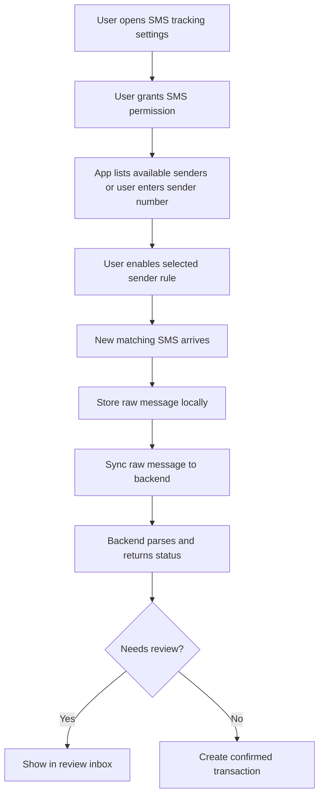

# finance-mobile

React Native Android app for quick capture and SMS-based transaction tracking.

## Current Status

Phase 1 scaffold now includes:

- Expo + React Native TypeScript setup.
- Environment-based API base URL (`EXPO_PUBLIC_API_BASE_URL`).
- Health check screen that calls `GET /api/health/`.
- Login test flow that calls `POST /api/auth/login/`.
- Access-token validation flow that calls `GET /api/auth/me/`.
- Account and category fetch flow for authenticated users:
  - `GET /api/accounts/`
  - `GET /api/categories/`
  - caches the latest account/category lists locally for offline form choices
- Quick add transaction form:
  - `POST /api/transactions/`
- Local manual transaction queue:
  - stores manual transaction drafts with AsyncStorage
  - syncs queued manual transactions to `POST /api/transactions/`
  - uses retry metadata and capped retry backoff for failed syncs
  - blocks obvious duplicate queued transactions
  - lets the user remove invalid queued transactions manually
- Transaction list flow:
  - `GET /api/transactions/`
  - caches the latest loaded transactions locally for offline startup review
- SMS tracking settings scaffold:
  - permission gate placeholder for native Android SMS access
  - `GET /api/payment-methods/`
  - `GET /api/messages/sender-rules/`
  - local sender rule enable/disable selection
- Local raw message queue:
  - stores queued raw messages with AsyncStorage
  - syncs queued messages to `POST /api/messages/import/`
  - keeps failed sync items queued for retry
  - records attempt count, last attempt time, next retry time, and last error per queued message
  - uses a capped exponential retry delay so failed messages are not retried on every tap
  - blocks obvious local duplicate queue entries before backend sync
  - lets the user remove invalid queued messages manually
- SMS review inbox:
  - loads parsed candidates from `GET /api/messages/review/`
  - shows parser hints, raw SMS evidence, and internal-transfer flags
  - shows parser confidence, raw message status, and review/duplicate reasons
  - lets the user select transaction type plus source/destination accounts
    before confirming transfers
  - confirms or ignores candidates through the review endpoints
- Debt/lending section:
  - loads records from `GET /api/debts/`
  - creates lent/borrowed records through `POST /api/debts/`
  - records repayments through `POST /api/debts/{id}/payments/`
  - shows open balances, due dates, compact totals, due-soon counts, and status
    chips
- Credit card bills section:
  - loads bills from `GET /api/credit-card-bills/`
  - creates statement bills through `POST /api/credit-card-bills/`
  - records payments through `POST /api/credit-card-bills/{id}/payments/`
  - shows remaining balances, due dates, compact totals, due-soon counts, and
    status chips
- Recurring bills section:
  - loads schedules from `GET /api/recurring-bills/`
  - creates repeating bills through `POST /api/recurring-bills/`
  - records payments through `POST /api/recurring-bills/{id}/payments/`
  - advances the next due date after payment and summarizes active bills,
    monthly recurring total, and due-soon count
- Balance reconciliation section:
  - loads expected balances from `GET /api/reconciliation/accounts/{account_id}/`
  - saves real-life balance checks through `POST /api/reconciliation/snapshots/`
  - shows expected, actual, difference, latest snapshot status, and difference
    context in compact mobile metrics
- Transaction API types include strict ledger evidence fields such as
  debit/credit direction, balance after, reference, counterparty text, payment
  method, raw message link, and duplicate key
- Native SMS permission/module decision documented in
  `docs/mobile-sms-permission-decision.md`.

## Local Run (Current)

Prerequisites:

- Node.js installed
- Android Studio emulator running (or physical Android device)
- Backend API running on `http://localhost:8000`

Setup:

```bash
cp .env.example .env
npm install
npm run start
```

From Expo terminal:

- Press `a` to open Android emulator.

If using Android emulator, default API base URL in `.env.example` already uses:

```txt
http://10.0.2.2:8000
```

If using a physical device, replace it with your machine's LAN IP:

```txt
EXPO_PUBLIC_API_BASE_URL=http://192.168.x.x:8000
```

The current login flow is for local testing. Production mobile auth should use
OS-backed secure storage for refresh tokens. See
`../../docs/auth-token-storage-plan.md`.

## Docker (Optional)

From `projects/finance-infra`:

```bash
cp .env.example .env
docker compose --profile mobile up --build finance-mobile
```

For day-to-day development, native Expo on host is still the recommended path.

## Responsibilities

- Quick manual transaction entry.
- Account/category sync.
- Android SMS permission flow.
- User-selected tracked SMS sender numbers.
- Local raw message storage.
- Message sync to backend.
- Review parsed transactions.
- Offline queue for manual entries.

## Suggested Stack

- React Native
- TypeScript
- React Navigation
- TanStack Query
- SQLite or MMKV for local queue/cache
- Native Android SMS module when needed

Expo can be used only if the SMS requirements remain compatible. If automatic
SMS reading requires native Android APIs not supported by Expo managed workflow,
use bare React Native.

## Android SMS Tracking Flow

Current decision: do not add broad Android SMS permissions in the Expo managed
scaffold. Build sender selection, import, duplicate detection, and review flows
first. If automatic capture is still required, move to Expo prebuild/custom dev
client or bare React Native and add a narrow native Android SMS module.



## Mobile Screens

```txt
Home
Quick Add Transaction
Transactions
Accounts
SMS Tracking Settings
SMS Review Inbox
Debts
Settings
```

## Offline Requirements

- Manual transactions can be saved offline in a local queue and synced later.
- Account/category choices are hydrated from the last successful local cache.
- The latest loaded transaction list is hydrated from the last successful local
  cache for offline startup review.
- Raw SMS messages can be queued offline.
- Sync retries when network is available and keeps per-message failure context.
- Failed raw SMS sync items wait for their next retry time before another attempt.
- Obvious local duplicate raw messages are blocked before sync.
- Conflicts are resolved by backend timestamps and ids.

## Phase 1 Mobile Milestones

1. Android app skeleton. Done.
2. Login. Done with placeholder/testing flow.
3. Backend health check. Done.
4. Account/category fetch. Done.
   - Local account/category cache. Done.
5. Quick add transaction. Done.
6. Local manual transaction queue. Done with retry metadata, capped retry
   backoff, local duplicate checks, and manual removal.
7. Transaction list. Done with local recent transaction cache hydration.
8. SMS sender selection scaffold. Done.
9. Local raw message cache and sync queue. Done.

## Phase 2 Mobile Milestones

1. SMS permission gate scaffold. Done.
2. Sender number management scaffold. Done.
3. Native Android SMS module decision. Done.
4. Local raw message cache. Done.
5. Raw message sync. Done with retry metadata, capped retry backoff, local
   duplicate checks, and manual removal for invalid queued messages.
6. Review inbox. Done.
7. Source/destination transfer controls. Done.

## Phase 4 Mobile Milestones

1. Debt/lending screen. Done for first mobile scaffold.
2. Credit-card bill screen. Done for first mobile scaffold.
3. Recurring-bill screen. Done for first mobile scaffold.
4. Reconciliation screen. Done for first mobile scaffold.
5. Compact mobile summary metrics and status chips for debt, card, recurring,
   and reconciliation workflows. Done for first polish pass.
